<div align="center">
  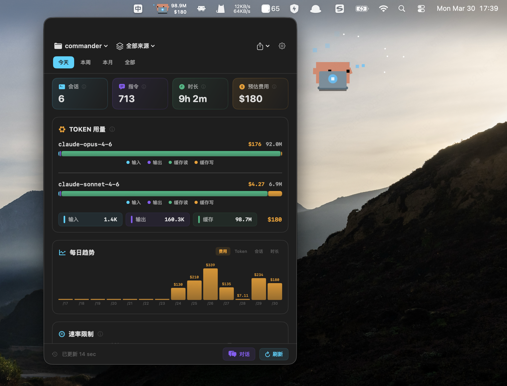
  <h1>cc-statistics</h1>
  <p><strong>唯一能把 Claude Code、Gemini CLI、Codex CLI 和 Cursor 统一到一个原生 macOS 应用的 AI 编程追踪工具。</strong></p>
  <p><em>追踪你所有 AI 工具的每一个 Token、费用和会话。100% 本地。零依赖。</em></p>

  <p>
    <a href="https://pypi.org/project/cc-statistics/"></a>
    <a href="https://pypi.org/project/cc-statistics/"></a>
    <a href="https://github.com/androidZzT/cc-statistics/stargazers"></a>
    <a href="LICENSE"></a>
    
    
  </p>

  <p>
    <a href="#-为什么选-cc-statistics">为什么？</a> &bull;
    <a href="#-功能特性">功能</a> &bull;
    <a href="#%EF%B8%8F-截图">截图</a> &bull;
    <a href="#-快速开始">快速开始</a> &bull;
    <a href="#-cli-参考">CLI</a> &bull;
    <a href="README.md">English</a>
  </p>
</div>

---

## 🤔 为什么选 cc-statistics？

你正在使用多种 AI 编程工具，但你真的知道：

- 💸 **跨工具的综合花费是多少**？Claude Code、Gemini CLI、Codex、Cursor 加在一起？
- 🔧 **哪些 MCP 工具调用最频繁**，它们是否值得消耗这么多 Token？
- ⏱️ **Claude 真正在工作的时间有多少**，有多少时间是在等你？
- 📈 **哪些项目消耗最多**，用的是哪些模型？

大多数工具只回答 Claude Code 的问题，cc-statistics 把四个平台都覆盖了。

### 横向对比

| | cc-statistics | CCDash | claude-usage | ccflare |
|---|:---:|:---:|:---:|:---:|
| **Claude Code** | ✅ | ✅ | ✅ | ✅ |
| **Gemini CLI** | ✅ | ❌ | ❌ | ❌ |
| **Codex CLI** | ✅ | ❌ | ❌ | ❌ |
| **Cursor** | ✅ | ❌ | ❌ | ❌ |
| **原生 macOS 应用** | ✅ | ❌ | ❌ | ❌ |
| **像素风 Clawd 吉祥物** | ✅ | ❌ | ❌ | ❌ |
| **会话搜索与恢复** | ✅ | ✅ | ❌ | ❌ |
| **周报 / 月报** | ✅ | ✅ | ❌ | ❌ |
| **Webhook**（飞书 / 钉钉 / Slack） | ✅ | ✅ Slack/Discord | ❌ | ❌ |
| **工具调用分析** | ✅ | ✅ | ❌ | ❌ |
| **按语言统计代码变更** | ✅ | ❌ | ❌ | ❌ |
| **AI 时长 vs 用户时长** | ✅ | ❌ | ❌ | ❌ |
| **用量预警** | ✅ | ✅ | ❌ | ❌ |
| **用量额度预测** | ✅ | ✅ | ❌ | ❌ |
| **分享会话消息** | ✅ | ❌ | ❌ | ❌ |
| **Web 仪表盘** | ✅ | ✅ | ✅ | ✅ |
| **CLI 工具** | ✅ | ✅ | ❌ | ✅ |
| **零依赖** | ✅ | ✅ | ❌ | ❌ |
| 缓存效率评级 | ⏳ 计划中 | ✅ | ❌ | ❌ |
| 实时流式更新 | ⏳ 计划中 | ✅ | ❌ | ❌ |

> cc-statistics 是社区项目，与 Anthropic、Google、OpenAI 无关。

---

## 🚀 功能特性

### 🌐 四平台统一视图
> Claude Code · Gemini CLI · Codex CLI · Cursor — 可切换单个平台或将四个平台聚合为一份报告。所有数据源均从本地文件读取，无需 API Key、无需登录、不发起任何网络请求。

### 🖥️ 原生 macOS 状态栏应用
> 预编译 SwiftUI 二进制 — 运行 `cc-stats-app` 后常驻状态栏。一眼看到 Claude logo + 当日 Token 用量 + 预估费用。触达每日用量额度时变**红**预警。右键菜单切换显示模式。全局快捷键 `Cmd+Shift+C` 随时唤出完整面板。

### 🐾 Clawd — 像素风状态栏吉祥物
> 像素风 Clawd 吉祥物实时感知 Claude Code 的 Agent 状态：空闲、思考、输入、开心、休眠、报错 — 每种状态对应独立动画精灵。基于 [clawd-on-desk](https://github.com/rullerzhou-afk/clawd-on-desk) hook 集成实现。


### 📊 用量额度预测
> 基于当前消耗速率实时预测何时触达用量额度。显示剩余预计时间、预计重置时间及风险等级，帮你合理分配用量，避免意外限速。

### 🔍 会话搜索与恢复
> 跨平台关键词搜索全部历史会话。结果展示时间戳及可直接运行的恢复命令 — 一键复制，立刻回到上下文：
> ```bash
> claude --resume <session-id>
> ```

### 💬 分享会话消息
> 将单个会话对话导出为整洁格式的文本 — 适合记录 AI 辅助工作过程、与团队成员共享上下文，或归档重要会话。

### 📊 多维统计分析
> 指令数 · 工具调用 Top 10（Skill 和 MCP 工具按名称拆分展示）· AI 处理时长 vs 用户活跃时长 · 按语言统计代码变更（通过 `git log --numstat`）· 按模型拆分 Token · 内置主流模型定价估算（Opus / Sonnet / Haiku / Gemini 2.5 Pro / Flash / GPT-4o）

### 🔔 用量预警
> 设置单日和每周费用上限。超限时 macOS 状态栏图标变红，并触发原生系统通知 — 尊重专注模式，无需应用在前台。

### 📋 周报 / 月报
> 自动生成任意时间段的 Markdown 摘要：总 Token、按模型分类费用、最活跃项目、工具调用 Top、按语言代码变更。直接推送到团队频道：
> ```bash
> cc-stats --report week
> cc-stats --notify https://hooks.slack.com/services/xxx
> ```
> 支持飞书、钉钉、Slack Webhook。

### ⚡ 项目对比
> 并排查看各项目的资源消耗情况：
> ```bash
> cc-stats --compare --since 1w
> ```

### 🌐 Web 仪表盘
> 浏览器端暗色主题统计面板，支持所有平台 — 在 Linux/Windows 上或希望比状态栏面板更大视图时使用。

### 🔒 100% 本地 · 零依赖
> 所有数据读取自本地文件，不联网，不上传。纯 Python 标准库 — 无需 `pip install`，无需 npm，无需 Docker。

---

## 🖼️ 截图

<table>
  <tr>
    <td align="center"><strong>🖥️ macOS 应用 — 深色模式</strong></td>
    <td align="center"><strong>🖥️ macOS 应用 — 浅色模式</strong></td>
  </tr>
  <tr>
    <td>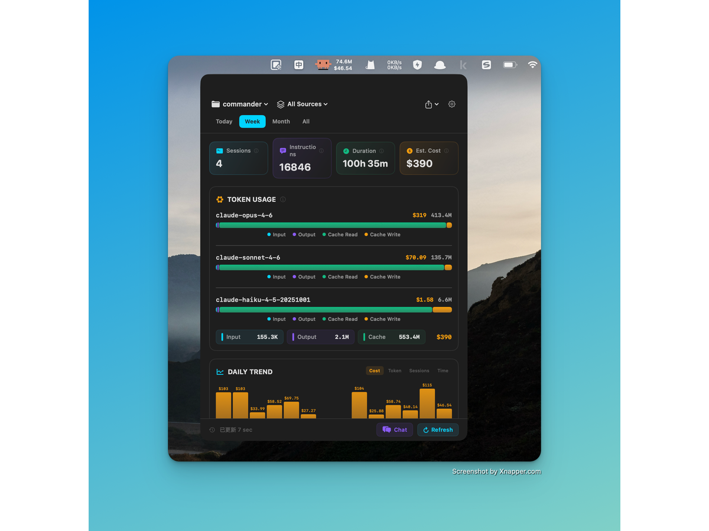</td>
    <td>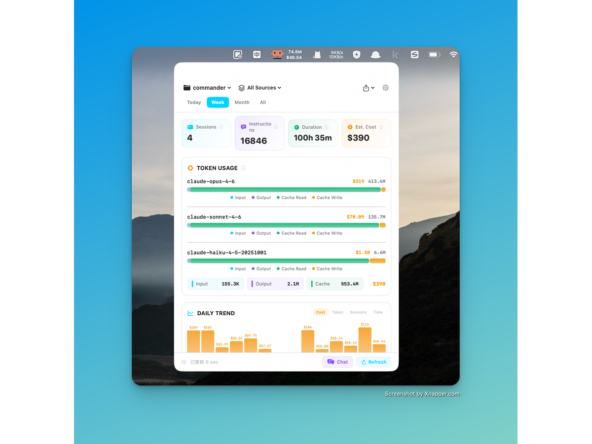</td>
  </tr>
  <tr>
    <td align="center"><strong>📊 用量额度预测</strong></td>
    <td align="center"><strong>🔴 用量达到上限</strong></td>
  </tr>
  <tr>
    <td>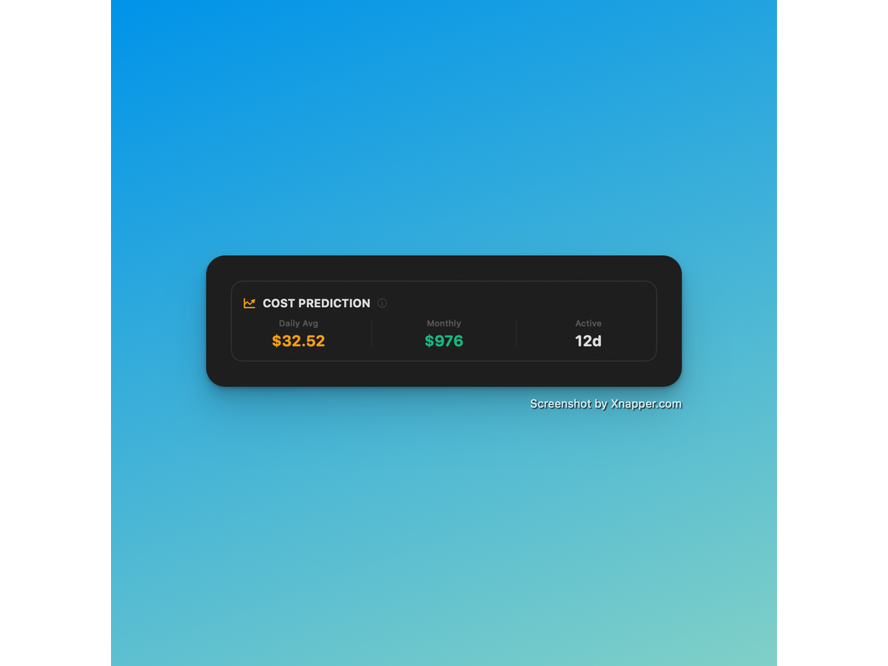</td>
    <td>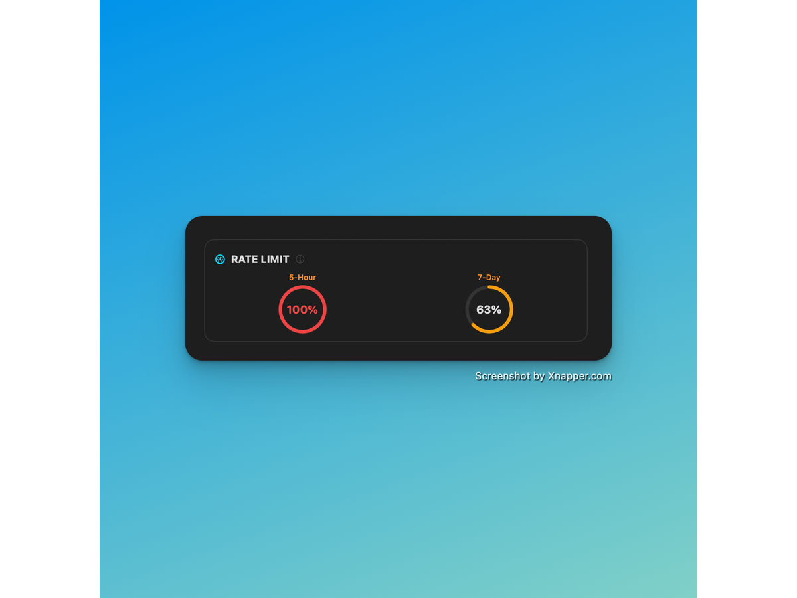</td>
  </tr>
  <tr>
    <td align="center"><strong>🔍 会话列表</strong></td>
    <td align="center"><strong>🔧 工具调用分析</strong></td>
  </tr>
  <tr>
    <td>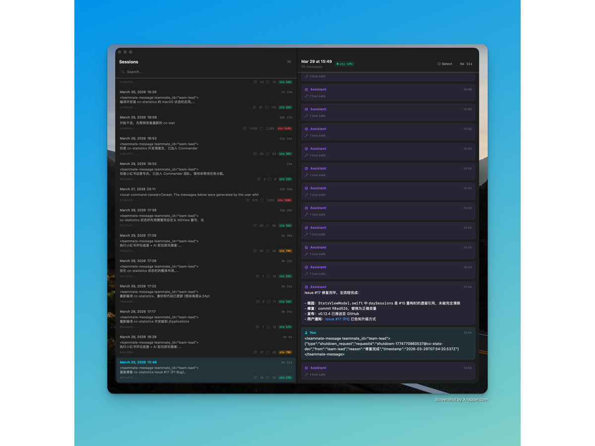</td>
    <td>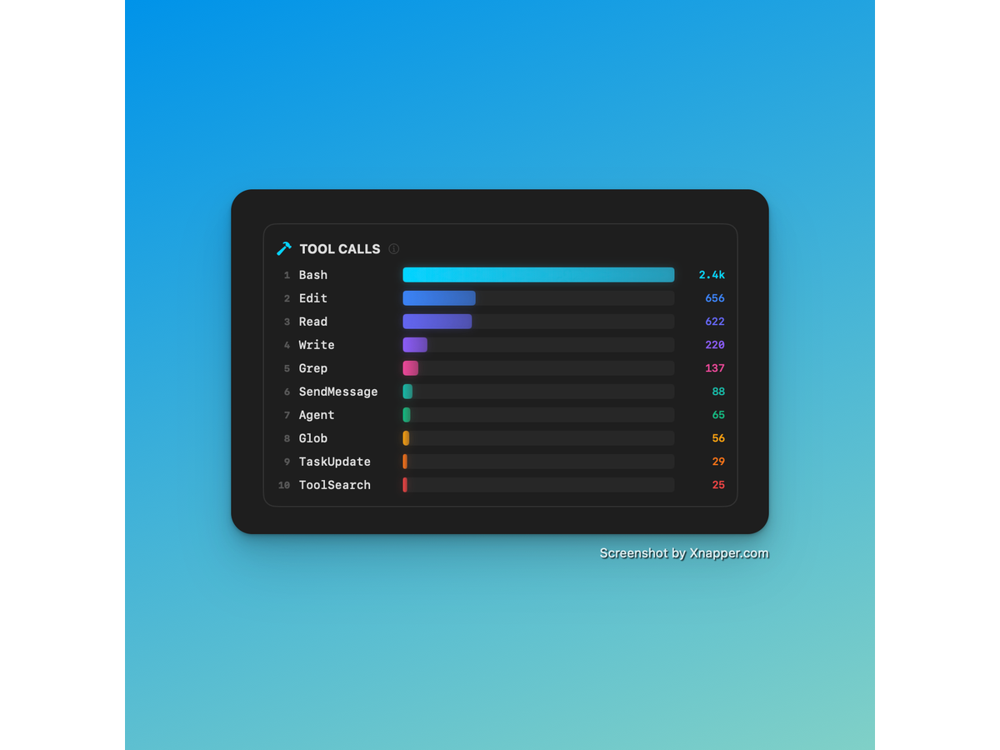</td>
  </tr>
  <tr>
    <td align="center"><strong>⚡ Skill / MCP 分析</strong></td>
    <td align="center"><strong>💬 分享会话消息</strong></td>
  </tr>
  <tr>
    <td>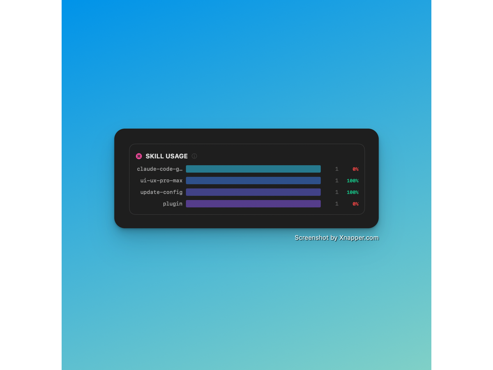</td>
    <td>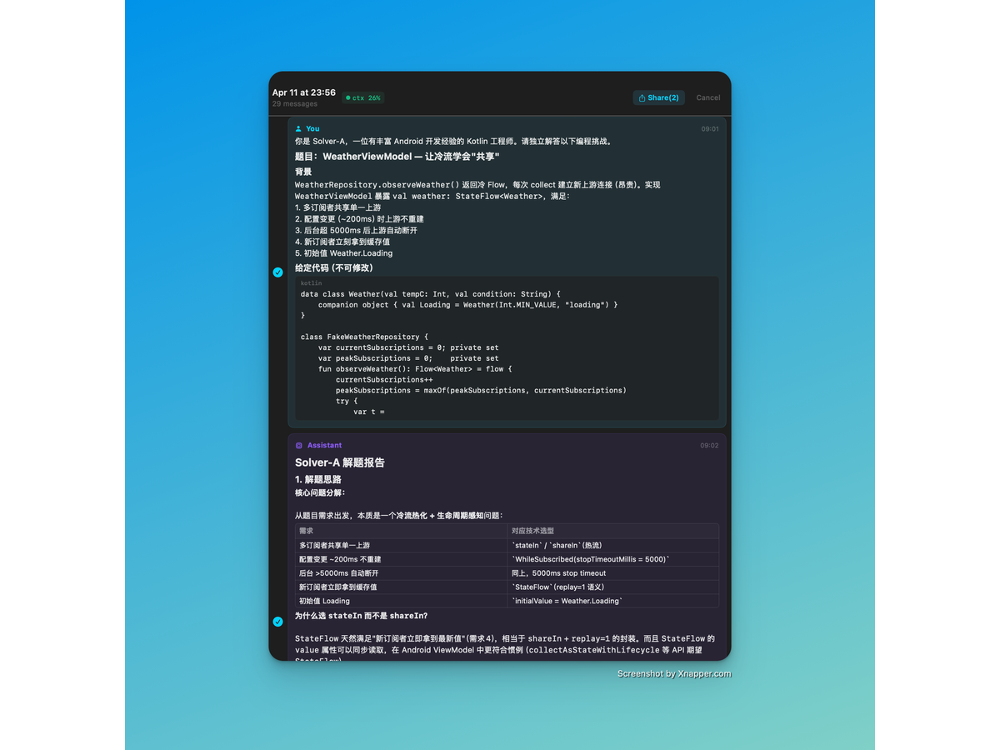</td>
  </tr>
  <tr>
    <td align="center"><strong>🌐 四平台统一视图</strong></td>
    <td align="center"><strong>⚙️ 设置</strong></td>
  </tr>
  <tr>
    <td>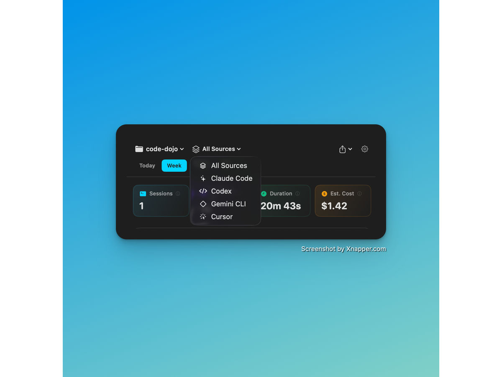</td>
    <td>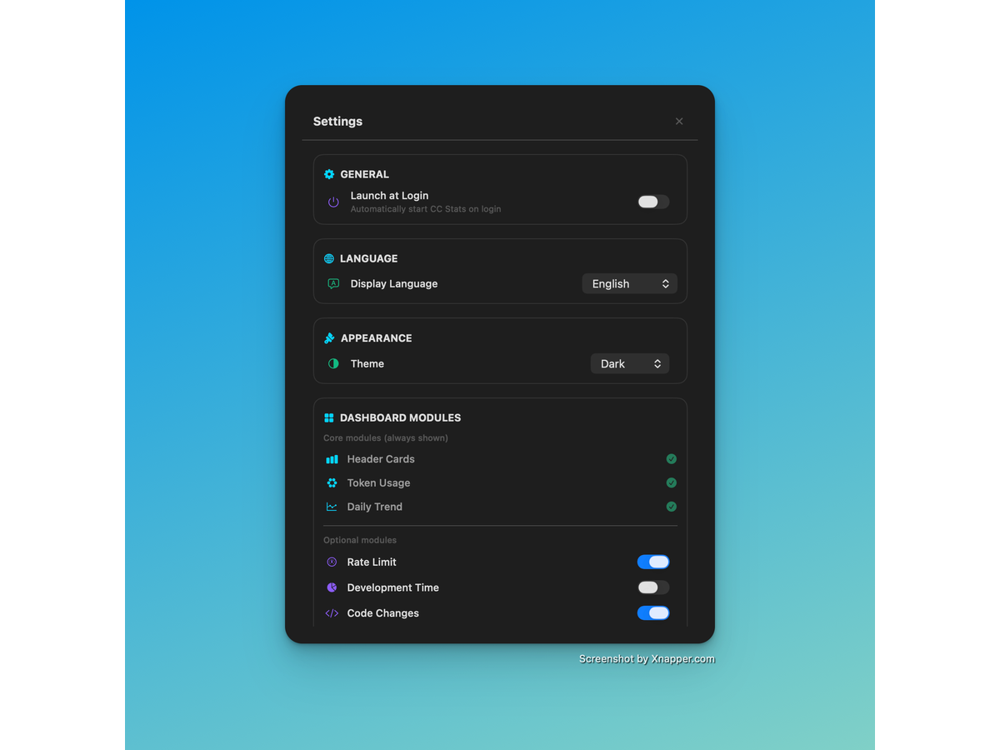</td>
  </tr>
  <tr>
    <td align="center"><strong>🔔 通知</strong></td>
    <td align="center"><strong>🌐 Web 仪表盘</strong></td>
  </tr>
  <tr>
    <td>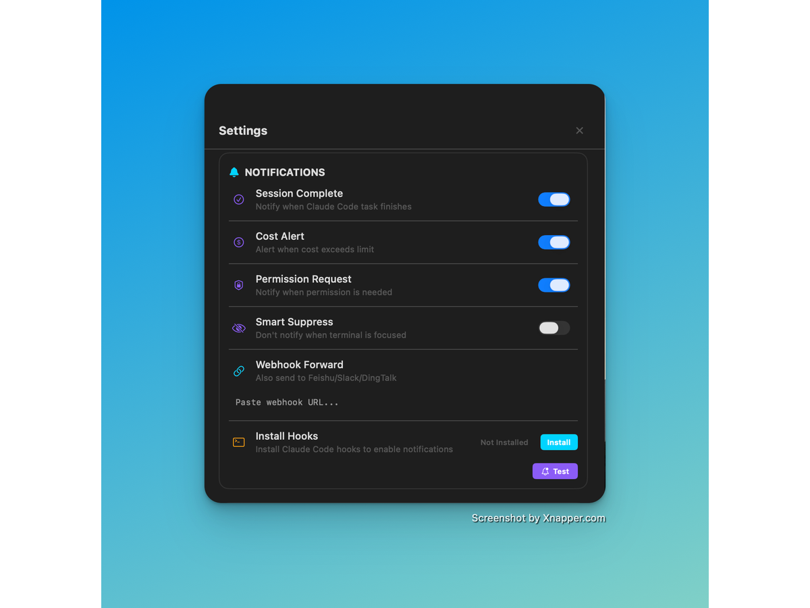</td>
    <td>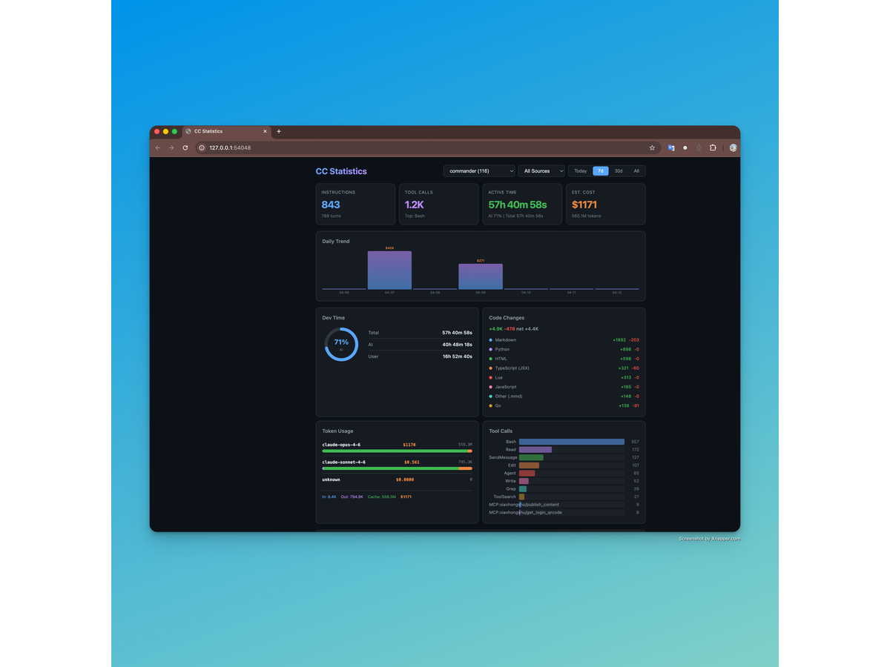</td>
  </tr>
</table>

### CLI 演示

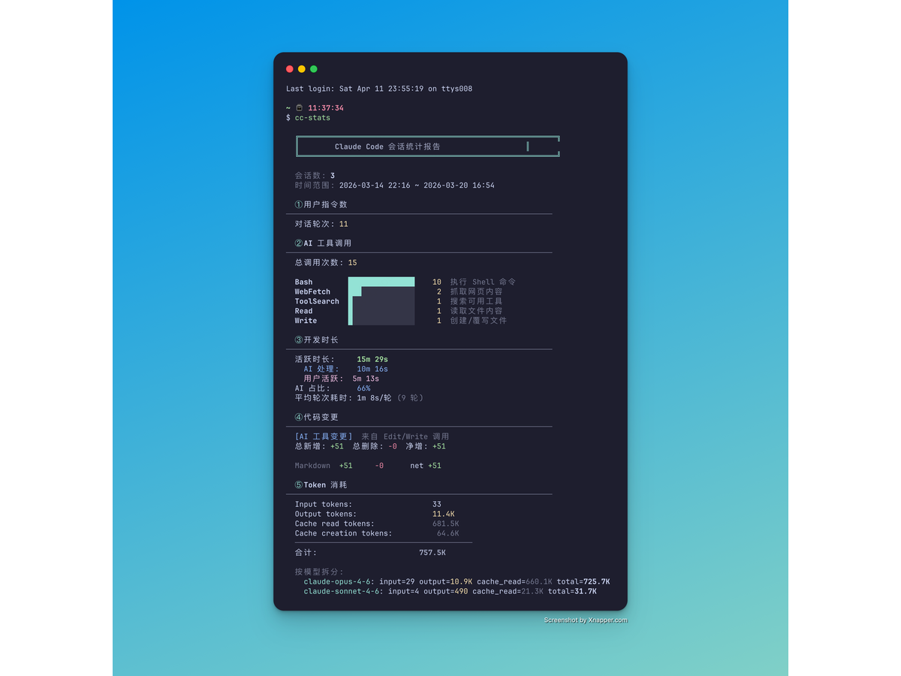

---

## ⚡ 快速开始

### 前置条件

- Python 3.8+
- 已安装并使用过以下至少一种工具：Claude Code CLI、Gemini CLI、Codex CLI 或 Cursor

### 3 步搞定

```bash
# 1. 安装
uv tool install cc-statistics   # 或：pipx install cc-statistics

# 2. 运行第一份报告（所有平台，最近 7 天）
cc-stats --all --since 7d

# 3. 启动 macOS 状态栏应用（仅 macOS）
cc-stats-app
```

无需任何配置文件。

**其他安装方式：**

```bash
# pipx
pipx install cc-statistics

# Homebrew（macOS / Linux）
brew install androidZzT/tap/cc-statistics
```

---

## 📖 CLI 参考

```bash
cc-stats                      # 分析当前目录的会话
cc-stats --list               # 列出所有检测到的项目（全平台）
cc-stats --all --since 3d     # 最近 3 天，所有项目，所有平台
cc-stats --all --since 1w     # 最近一周
cc-stats myproject --last 3   # 某项目最近 3 个会话
cc-stats --report week        # 生成周报（Markdown）
cc-stats --report month       # 生成月报（Markdown）
cc-stats --compare --since 1w # 项目并排对比
cc-stats --notify <url>       # 推送报告到 Slack / 飞书 / 钉钉 Webhook
cc-stats-web                  # 浏览器打开 Web 仪表盘
cc-stats-app                  # 启动 macOS 状态栏应用
```

---

## 🗂️ 数据来源

所有数据读取自本地文件，不联网，不上传。

| 数据源 | 本地路径 |
|--------|---------|
| Claude Code | `~/.claude/projects/<project>/<session>.jsonl` |
| Gemini CLI | `~/.gemini/tmp/<project>/chats/<session>.json` |
| Codex CLI | `~/.codex/sessions/*.jsonl` |
| Cursor | `~/Library/Application Support/Cursor/User/globalStorage/state.vscdb` |
| Git 变更 | 项目目录的 `git log --numstat` |

---

## 致谢

状态栏 Clawd 动画素材来自 [clawd-on-desk](https://github.com/rullerzhou-afk/clawd-on-desk) — 一个 Electron 桌面宠物应用，通过 hook 系统实时感知 AI coding agent 的工作状态并播放像素风动画。

---

## 请 cc 吃 Token

如果这个工具帮你省了 AI 编程的钱，欢迎[赞助](https://github.com/sponsors/androidZzT)项目 :)


