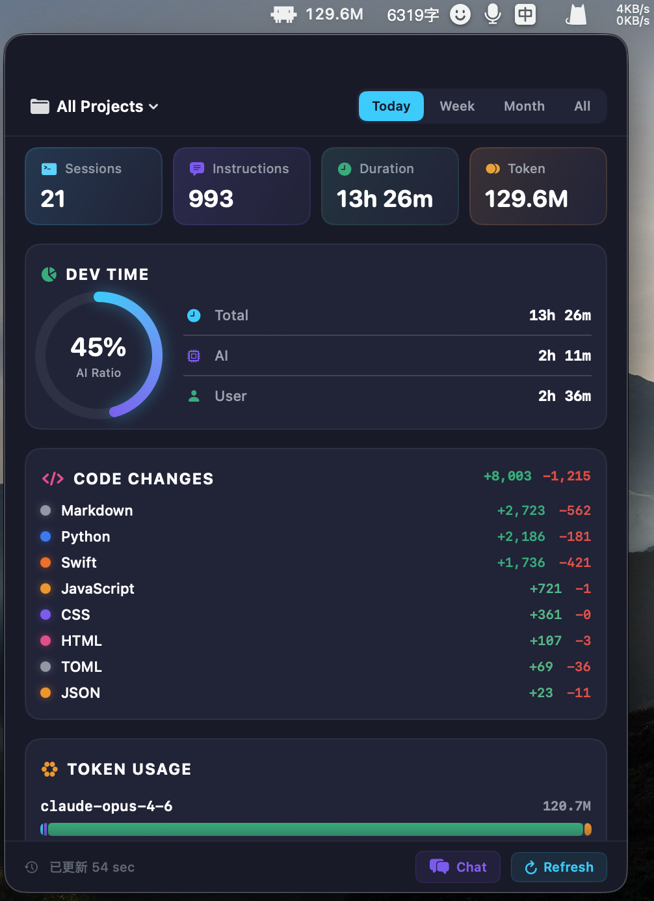

# cc-statistics

English | [中文](README.md)

Claude Code session statistics tool — extract AI coding metrics from local `~/.claude/` data.



## Highlights

- **Cost Estimation** — Auto-calculate costs based on Opus / Sonnet / Haiku / GPT-4o pricing
- **Session Search & Resume** — Search past conversations, click to copy `claude --resume` command
- **Multi-dimensional Stats** — Instructions, Tool calls Top 10, Dev time (AI vs User), Code changes (by language), Token usage (by model)
- **Daily Trend** — 14-day cost trend chart to spot usage patterns
- **Usage Alerts** — Set daily/weekly cost limits, status bar turns red + system notification when exceeded
- **100% Local** — All data read from local files, nothing uploaded
- **Three Modes** — CLI + Web Dashboard (cross-platform) + macOS native menu bar panel
- **Bilingual** — Auto-follows system language, supports manual Chinese / English switch

## Installation

```bash
# Recommended: pipx for global install
pipx install cc-statistics

# Or via pip
pip install cc-statistics
```

Zero dependencies — Python stdlib only.

### From Source

```bash
git clone https://github.com/androidZzT/cc-statistics.git
cd cc-statistics
python3 -m venv .venv
source .venv/bin/activate
pip install -e .
```

## Usage

### CLI (All Platforms)

```bash
cc-stats                     # Analyze current directory sessions
cc-stats --list              # List all projects
cc-stats compose-album       # Match project by keyword
cc-stats --all --since 3d    # Last 3 days, all projects
cc-stats --all --since 2w    # Last 2 weeks
cc-stats sailor --last 3     # Last 3 sessions for a project
cc-stats --report week       # Generate weekly report (Markdown)
cc-stats --report month      # Generate monthly report
cc-stats --compare           # Compare all projects side by side
cc-stats --compare --since 1w # Compare projects (last week)
```

### Webhook Notifications (Feishu / DingTalk / Slack)

Push daily stats summary to your team chat:

```bash
# Feishu/Lark (auto-detected)
cc-stats --notify https://open.feishu.cn/open-apis/bot/v2/hook/xxx

# DingTalk
cc-stats --notify https://oapi.dingtalk.com/robot/send?access_token=xxx

# Slack
cc-stats --notify https://hooks.slack.com/services/xxx

# Specify platform manually
cc-stats --notify <url> --platform slack
```

Includes: instructions, active time, tokens, cost, code changes, efficiency grade.

Set up daily auto-push with cron:

```bash
# Push daily report at 9pm
0 21 * * * cc-stats --notify https://hooks.slack.com/services/xxx
```

### Web Dashboard (All Platforms: macOS / Windows / Linux)

```bash
cc-stats-web
```

Auto-opens browser with a dark-themed statistics dashboard:

- Project selector + time range filter (Today / 7d / 30d / All)
- 4 stat cards: Instructions, Tool calls, Active time, Estimated cost
- Daily trend: 14-day cost bar chart
- Dev time: AI ratio ring + time breakdown
- Code changes: Git commits + per-language breakdown
- Token usage: stacked bar by model + per-model cost
- Tool calls: Top 10 ranking

### macOS Menu Bar Panel (macOS Only)

```bash
cc-stats-app
```

> Requires Xcode Command Line Tools (`xcode-select --install`). Swift component auto-compiles on first launch.

**Status Bar:**
- Claude logo + today's token usage + estimated cost
- Right-click to switch display mode (Token+Cost / Token / Cost / Sessions)
- Turns red when over limit

**Dashboard Panel (Native SwiftUI):**
- Multi-source: Claude Code / Codex / Cursor, switch or aggregate
- Theme: Follow System / Dark / Light
- Usage alerts: daily/weekly cost limits with system notifications
- Export stats to JSON / CSV (auto-saves to Desktop)
- Settings: Launch at login, language switch, theme, version update check
- Session search + one-click resume (`claude --resume`)
- Process manager: view all Claude process memory usage
- Tool call breakdown: Skill and MCP tools expanded to specific names
- Global hotkey `Cmd+Shift+C`

## Commands Overview

| Command | Platform | Description |
|---------|----------|-------------|
| `cc-stats` | All | CLI terminal output |
| `cc-stats-web` | All | Browser web dashboard |
| `cc-stats-app` | macOS only | Native menu bar panel |

## Data Sources

All data is read from local `~/.claude/` files. Nothing is sent over the network.

| Data | Source |
|------|--------|
| Session messages | `~/.claude/projects/<project>/<session>.jsonl` |
| Tool calls | `tool_use` blocks in assistant messages |
| Token usage | `usage` field in assistant messages |
| Git changes | `git log --numstat` in project directory |

## Buy cc Some Tokens

If this tool helps you, feel free to buy cc some tokens :)


